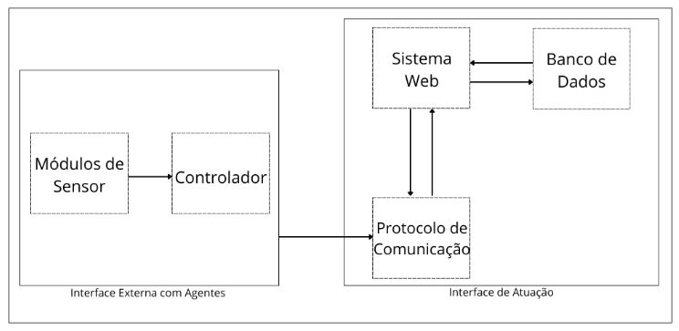
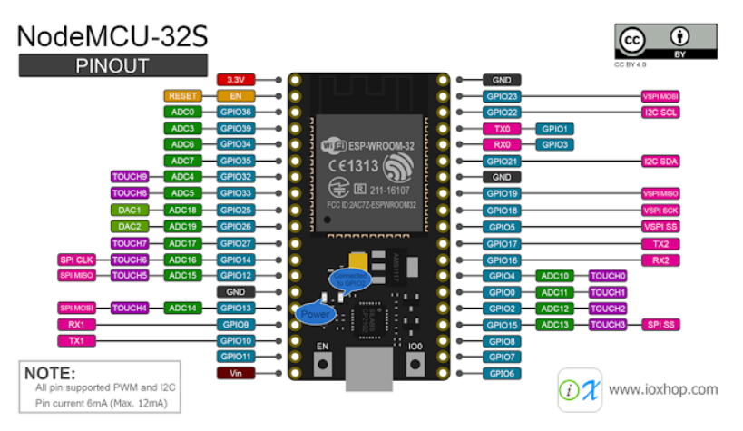
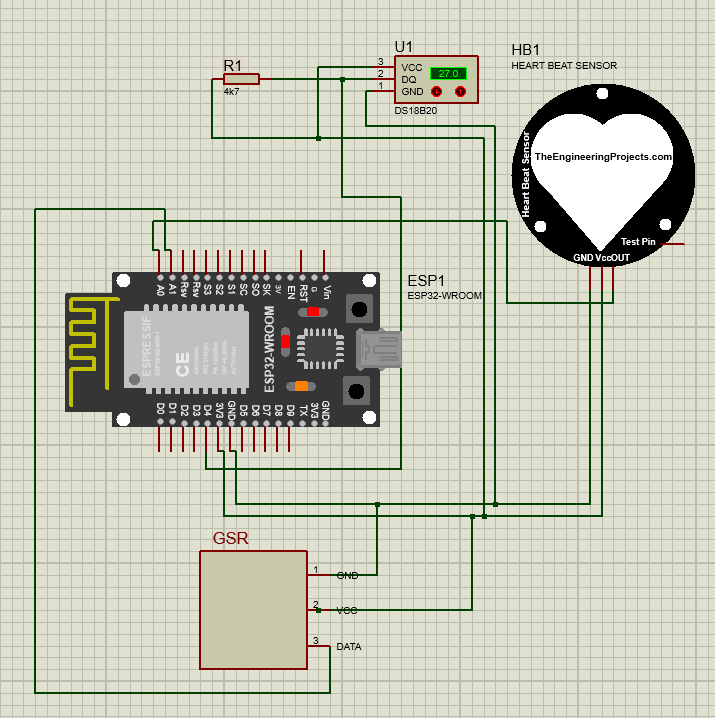
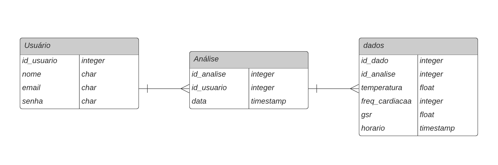
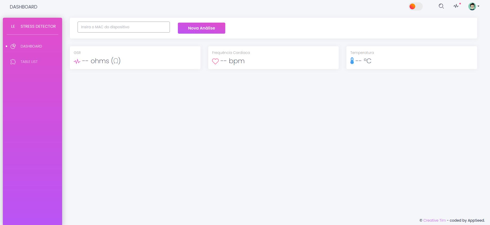

# UBÍQUOS_STRESS_DETECTOR
Repositório para o trabalho final da disciplina de **Projetos de Sistemas Ubíquos** da UFSC, campus de Araranguá. O presente trabalho consiste no desenvolvimento de um protótipo de um detector de estresse destinado a profissionais da área da saúde, integrando sensores de Resposta Galvânica da Pele (do inglês _Galvanic Skin Response_ - GSR), Frequência Cardiaca (conhecido no ingês como _Pulse Sensor_ e de temperatura (DS18B20)), a um sistema web com backend em django por meio de comunicação com o protocolo de Transporte de Telemetria ded Enfileiramento de Menagens (do inglês _Message Queuing Telemetry Transport_ - MQTT).

<br> 

<div id='summary'>
<h2>Sumário</h2>
<ul>
  <li><a href='#tecnologias-e-ferramentas'>Tecnologias e Ferramentas</a></li>
  <li><a href='#bibliotecas'>Bibliotecas</a></li>
  <li><a href='#fundamentos-para-detecção-de-estresse'>Fundamentos para Detecção de Estresse</a></li>
  <li><a href='#arquitetura-do-sistema'>Arquitetura do Sistema</a></li>
  <li><a href='#modelagem-do-hardware'>Modelagem do Hardware</a></li>
  <li><a href='#modelagem-do-banco-de-dados'>Modelagem do Banco de Dados</a></li>
  <li><a href='#modelagem-do-sistema-web'>Modelagem do Sistema Web</a></li>
  <li><a href='#implementação-do-código-javascript'>Implementação do Código JavaScript</a></li>
  <li><a href='#implementação-das-views-no-django'>Implementação das Views no Django</a></li>
  <li><a href='#requisitos-atendidos'>Requisitos Atendidos</a></li>
  <li><a href='#trabalhos-futuros'>Trabalhos Futuros</a></li>
  <li><a href='#como-rodar-localmente'>Como Rodar Localmente</a></li>
  <li><a href='#código-e-documentação'>Código e Documentação</a></li>
</ul>
</div>


## Tecnologias e Ferramentas

- **Sensores:** GSR, Frequência Cardíaca (Pulse Sensor), DS18B20 (Temperatura).
- **Backend:** Django.
- **Banco de Dados:** MySQL.
- **Comunicação:** MQTT.
- **Placa de Desenvolvimento:** ESP32.

### Bibliotecas

<center>
<table>
    <tr>
        <th>Biblioteca</th>
        <th>Versão</th>
        <th>Descrição</th>
    </tr>
    <tr>
        <td>Arduino.h</td>
        <td>-</td>
        <td>Biblioteca padrão do Arduino</td>
    </tr>
    <tr>
        <td>WiFi.h</td>
        <td>1.2.7</td>
        <td>Para comunicação WiFi</td>
    </tr>
    <tr>
        <td>PubSubClient.h</td>
        <td>2.8.0</td>
        <td>Comunicação MQTT</td>
    </tr>
    <tr>
        <td>OneWire.h</td>
        <td>2.3.7</td>
        <td>Biblioteca do serial do sensor de temperatura</td>
    </tr>
    <tr>
        <td>DallasTemperature.h</td>
        <td>3.9.0</td>
        <td>Biblioteca do sensor de temperatura</td>
    </tr>
    <tr>
        <td>PulseSensorPlayground.h</td>
        <td>1.9.1</td>
        <td>Biblioteca do sensor de frequência cardíaca</td>
    </tr>
</table>
</center>

<br>

## Fundamentos para Detecção de Estresse
O estresse é uma resposta física e psicológica do corpo a desafios ou demandas. É caracterizado por mudanças fisiológicas e comportamentais, como aumento da frequência cardíaca, tensão muscular, alterações na respiração e na transpiração. A detecção de estresse tornou-se um campo de interesse vital, particularmente em ambientes profissionais de alta pressão, como o setor de saúde.

> ### Detecção de Estresse com Sensores
>
> #### Sensor GSR (Galvanic Skin Response): 
> - **O que é:** O sensor GSR mede a condutividade elétrica da pele, que varia com a sua umidade.
> - **Detecção de Estresse:** Durante o estresse, as glândulas sudoríparas são mais ativas, aumentando a umidade da pele e, consequentemente, sua condutividade. O sensor GSR detecta essas mudanças, fornecendo uma indicação quantitativa do nível de estresse.
> - **Parâmetros para medição**:
>   - **Baixo Estresse:** Condutividade abaixo de 10 kΩ, indicando um estado de calma ou relaxamento.
>   - **Estresse Moderado:** Condutividade entre 10 kΩ e 50 kΩ, representando um estado de alerta ou ansiedade leve.
>   - **Alto Estresse:** Condutividade acima de 50 kΩ, sugerindo um estado elevado de estresse ou ansiedade.
>
> ### Sensor de Frequência Cardíaca (Pulse Sensor)
> - **O que é:** Este sensor monitora a frequência cardíaca ao detectar as pulsações do sangue através da pele.
> - **Detecção de Estresse:** O estresse pode acelerar a frequência cardíaca. A monitoração da frequência cardíaca permite detectar essas alterações, sendo um indicador importante de estresse agudo.
> - **Parâmetros para medição**:
>   - **Normal:** Frequência cardíaca de 50 a 90 batimentos por minuto (bpm) em repouso.
>   - **Estresse Leve a Moderado:** Frequência cardíaca entre 90 e 120 bpm, pode indicar nervosismo ou ansiedade.
>   - **Alto Estresse:** Frequência cardíaca acima de 120 bpm, especialmente em repouso, sugere um estado elevado de estresse ou ansiedade.
>
> ### Sensor de Temperatura (DS18B20)
> - **O que é:** O DS18B20 é um sensor de temperatura que pode ser usado para medir a temperatura do corpo ou do ambiente.
> - **Detecção de Estresse:** Embora as variações de temperatura do corpo devido ao estresse sejam mais sutis em comparação com outros indicadores, a temperatura da pele pode diminuir em situações de estresse, devido à vasoconstrição periférica.
> - **Parâmetros para medição**:
>   - **Normal:** Temperatura corporal entre 36,1°C e 37,2°C.
>   - **Possível Estresse:** Variações na temperatura corporal, como uma queda para abaixo de 36,1°C, podem indicar estresse, particularmente se acompanhadas por outros indicadores.
>   - **Atenção:** Variações extremas de temperatura corporal, para mais ou menos, devem ser avaliadas com cuidado, pois podem indicar condições médicas além do estresse.
>

<br>

## Arquitetura do Sistema
A arquitetura do sistema do detector de estresse é projetada para haver a integração entre os componentes de hardware e software, garantindo a coleta eficiente e o processamento de dados fisiológicos. Os módulos de sensor são responsáveis pela aquisição direta de dados biológicos, como frequência cardíaca e resistência da pele, que são posteriormente encaminhados ao controlador. O controlador atua como o núcleo de processamento, onde os dados são inicialmente tratados e interpretados.

Uma vez processados, os dados são enviados através de um protocolo de comunicação MQTT, um método leve e eficiente para a transferência de mensagens entre dispositivos com recursos limitados. O sistema web desempenha um papel duplo, agindo tanto como uma interface de usuário para a apresentação das informações processadas quanto como um sistema de back-end para o armazenamento seguro dos dados coletados em um banco de dados. Esta dualidade assegura que os dados possam ser acessados para análise futura e também em tempo real para monitoramento.

Abaixo está o diagrama de blocos representando a arquitetura do sistema:

<center>
    
</center>

#### 1. Especificações do Sensor Grove - GSR

<center>
<table>
    <tr>
        <th>Parâmetro</th>
        <th>Descrição</th>
    </tr>
    <tr>
        <td>Nome do Produto</td>
        <td>Grove - GSR Sensor</td>
    </tr>
    <tr>
        <td>Versão</td>
        <td>V1.2 (31/07/2014)</td>
    </tr>
    <tr>
        <td>Funcionalidade</td>
        <td>Medição da resistência da pele (GSR)</td>
    </tr>
    <tr>
        <td>Tensão de Operação</td>
        <td>3.3V/5V</td>
    </tr>
    <tr>
        <td>Sensibilidade</td>
        <td>Ajustável via potenciômetro</td>
    </tr>
    <tr>
        <td>Sinal de Entrada</td>
        <td>Resistência (não Condutividade)</td>
    </tr>
    <tr>
        <td>Sinal de Saída</td>
        <td>Tensão, leitura analógica</td>
    </tr>
    <tr>
        <td>Material de Contato</td>
        <td>Níquel</td>
    </tr>
</table>
</center>

#### 2. Especificações do Sensor de Frequência Cardíca - Pulse Sensor

<center>
<table>
    <tr>
        <th>Parâmetro</th>
        <th>Descrição</th>
    </tr>
    <tr>
        <td>Nome do Produto</td>
        <td>Pulse Sensor</td>
    </tr>
    <tr>
        <td>Descrição Geral</td>
        <td>Sensor óptico de baixo custo para medição da frequência cardíaca (PPG) para Arduino e outras microcontroladoras</td>
    </tr>
    <tr>
        <td>Fabricante</td>
        <td>World Famous Electronics</td>
    </tr>
    <tr>
        <td>Características</td>
        <td>Inclui acessórios do kit, Plug and Play, Pequeno, Compatível com MCU com ADC, Funciona com 3V ou 5V, Biblioteca Arduino</td>
    </tr>
    <tr>
        <td>Faixa de Temperatura Operacional</td>
        <td>-40°C a +85°C</td>
    </tr>
    <tr>
        <td>Faixa de Tensão de Entrada</td>
        <td>3 a 5.5 V</td>
    </tr>
    <tr>
        <td>Faixa de Tensão de Saída</td>
        <td>0.3 a Vdd V</td>
    </tr>
    <tr>
        <td>Corrente de Alimentação</td>
        <td>3 a 4 mA</td>
    </tr>
</table>
</center>

#### 3. Especificações do Sensor de Temperatura - DS18B20

<center>
<table>
    <tr>
        <th>Parâmetro</th>
        <th>Descrição</th>
    </tr>
    <tr>
        <td>Nome do Produto</td>
        <td>DS18B20</td>
    </tr>
    <tr>
        <td>Descrição Geral</td>
        <td>Termômetro digital que fornece medições de temperatura em Celsius de 9 a 12 bits</td>
    </tr>
    <tr>
        <td>Características Especiais</td>
        <td>Interface 1-Wire, Mede -55°C a +125°C, Precisão de ±0.5°C, Resolução de 9 a 12 bits, Não requer componentes externos</td>
    </tr>
    <tr>
        <td>Taxa de Tensão</td>
        <td>3 a 5.5 V</td>
    </tr>
    <tr>
        <td>Aplicações</td>
        <td>Controles termostáticos, Sistemas industriais, Produtos de consumo, Termômetros, Sistemas sensíveis à temperatura</td>
    </tr>
</table>
</center>

#### 4. Principais Especificações do ESP32

<center>
<table>
    <tr>
        <th>Parâmetro</th>
        <th>Descrição</th>
    </tr>
    <tr>
        <td>Nome do Produto</td>
        <td>ESP32</td>
    </tr>
    <tr>
        <td>Descrição Geral</td>
        <td>Chip combo Wi-Fi e Bluetooth de 2,4 GHz projetado com tecnologia TSMC de baixo consumo de 40 nm</td>
    </tr>
    <tr>
        <td>Características Principais</td>
        <td>Wi-Fi 802.11b/g/n, Wi-Fi 802.11n (2.4 GHz, até 150 Mbps), Bluetooth v4.2 BR/EDR e LE, 2 ou 1 x Xtensa® 32-bit LX6 Microprocessors</td>
    </tr>
    <tr>
        <td>Capacidades</td>
        <td>Modos de infraestrutura, SoftAP e promíscuo simultâneos, Aceleração de hardware criptográfico, ADC, DAC, I2C, I2S, SDIO, UART, ETH, PWM, sensor de toque</td>
    </tr>
    <tr>
        <td>Memória</td>
        <td>Flash ou PSRAM integrados, SRAM</td>
    </tr>
    <tr>
        <td>Alimentação</td>
        <td>3.3V (tensão típica)</td>
    </tr>
</table>
</center>

#### Pinagem do ESP32
<center>
    
</center>

### Modelagem do Hardware

Na modelagem do hardware deste sistema, diversos componentes foram cuidadosamente selecionados e configurados para medir dados fisiológicos. O ADC0 foi utilizado para a leitura do sensor de pulso, que é crucial para a detecção de frequência cardíaca. A GPIO4 foi designada para o sensor de temperatura DS18B20, utilizando o protocolo OneWire para comunicação. Já a GPIO34 foi dedicada ao sensor GSR, responsável pela medição da condutância da pele, que pode indicar alterações no estado emocional do usuário. Além disso, foi implementado um resistor de pull-up de 4,7kΩ para garantir leituras precisas e estáveis do sensor de temperatura.

Esquemático do circuito:

<center>
    
</center>

### Modelagem do Banco de Dados

O sistema de detecção de estresse utiliza um banco de dados MySQL para armazenar e gerenciar os dados coletados. A modelagem do banco de dados foi implementada dentro do Django, um framework de desenvolvimento web de alto nível que encoraja o desenvolvimento rápido e limpo, com um design pragmático. O banco de dados é composto por três tabelas principais:

1. **Usuário**: Armazena informações de identificação dos usuários, incluindo nome, e-mail e senha.
2. **Análise**: Contém registros de cada análise realizada, vinculada ao usuário correspondente e marcada com um carimbo de data/hora.
3. **Dados**: Captura os dados fisiológicos coletados, como temperatura, frequência cardíaca e condutância da pele (GSR), associados a uma análise específica.

Este design permite o armazenamento eficiente de dados de forma estruturada, facilitando o acesso e a análise dos mesmos. A relação entre as tabelas é estabelecida através de chaves estrangeiras, que associam cada análise a um usuário específico e cada conjunto de dados fisiológicos a uma análise correspondente.

Abaixo está o diagrama entidade-relacionamento (ER) que ilustra a estrutura do banco de dados:

<center>
    
</center>

### Modelagem do Sistema Web

O sistema web do detector de estresse foi desenvolvido a partir de um template adaptado para Django, com o uso de Bootstrap do Creative Tim, e codificado por AppSeed. O template foi localizado para o português brasileiro (pt-br), e a página principal foi personalizada para permitir que o usuário insira o endereço MAC do dispositivo e solicite a coleta de dados.

Para possibilitar a atualização dos dados em tempo real, foi implementado um código AJAX na página. O script AJAX é responsável por iniciar a análise de dados ao receber um endereço MAC válido, fazendo uma requisição POST para o servidor. Em seguida, a função `atualizarDadosSensores` é chamada a cada cinco segundos para atualizar os valores de GSR, frequência cardíaca e temperatura apresentados na interface do usuário.

A lógica AJAX garante que, uma vez iniciada a análise, os dados são atualizados regularmente sem a necessidade de recarregar a página, proporcionando uma experiência de usuário fluida e responsiva.

Abaixo está a representação da interface principal do sistema web:

<center>
    
</center>

<br>

#### Implementação do Código JavaScript

O código JavaScript abaixo é responsável pela interação do usuário com o sistema web através de requisições AJAX, que permitem atualizações em tempo real sem recarregar a página.

```js

<!-- Carregamento do jQuery, uma biblioteca JavaScript rápida, pequena e rica em recursos. -->
<script src="https://ajax.googleapis.com/ajax/libs/jquery/3.5.1/jquery.min.js"></script>

<script>
    // Função para obter o valor do cookie CSRF do Django para segurança nas requisições AJAX.
	function getCookie(name) {
		let cookieValue = null;
		if (document.cookie && document.cookie !== "") {
			const cookies = document.cookie.split(";");
			for (let i = 0; i < cookies.length; i++) {
				const cookie = cookies[i].trim();
				if (cookie.substring(0, name.length + 1) === (name + "=")) {
					cookieValue = decodeURIComponent(cookie.substring(name.length + 1));
					break;
				}
			}
		}
		return cookieValue;
	}

	// Obtenção do token CSRF usando a função acima.
	const csrftoken = getCookie("csrftoken");

    // Função para iniciar a análise dos dados coletados pelo dispositivo de hardware.
    function startAnalysis() {
        // Obtém o endereço MAC fornecido pelo usuário no campo de input.
        var macAddress = $("#macInput").val();
        if (macAddress) {
            // Requisição AJAX para iniciar a análise de dados.
            $.ajax({
                url: "iniciar-analise/",
                type: "POST",
                headers: {"X-CSRFToken": csrftoken},
                data: {mac_address: macAddress},
                success: function (response) {
                    console.log("Análise iniciada", response);
                    // Inicia a função de atualização dos dados dos sensores.
                    atualizarDadosSensores();
                    // Define um intervalo para atualizar os dados a cada 5 segundos.
                    intervaloAtualizacao = setInterval(atualizarDadosSensores, 5000);
                },
                error: function (error) {
                    console.error("Erro ao iniciar análise:", error);
                },
            });
        } else {
            alert("Por favor, insira o endereço MAC.");
        }
    }

    // Função para atualizar os dados dos sensores na interface do usuário.
    function atualizarDadosSensores() {
        $.ajax({
            url: "obter-dados-sensores/",
            type: "GET",
            success: function (response) {
                // Atualiza os valores dos sensores na página.
                $("#gsrValue").text(response.gsr);
                $("#heartRateValue").text(response.freq_cardiaca);
                $("#temperatureValue").text(response.temperatura);
                // Se a coleta de dados foi finalizada, limpa o intervalo.
                if (response.coleta_ativa == 'False') {
                    clearInterval(intervaloAtualizacao);
                    console.log("Coleta de dados finalizada.");
                }
            },
            error: function (error) {
                console.error("Erro ao obter dados dos sensores:", error);
            },
        });
    }
</script>

```

<br>

#### Implementação das Views no Django

As views são uma parte crucial do framework Django, lidando com a lógica da aplicação e respondendo às requisições HTTP. Abaixo está a implementação de duas views que lidam com o início da análise de dados e a obtenção de dados dos sensores, respectivamente.

```python
from django.http import JsonResponse
from django.views.decorators.http import require_POST
from paho.mqtt import publish
from .models import Analise, DadoSensor

@require_POST
def iniciar_analise(request):
    # Recebe o endereço MAC via POST e inicia a análise.
    mac_address = request.POST.get('mac_address')
    print(f"Iniciando análise para o MAC Address: {mac_address}")  # Log para verificação
    
    try:
        # Envia um comando MQTT para o tópico apropriado.
        publish.single('esp32/sensores/comandos', mac_address, port=1883, hostname='localhost')
        message = 'Análise iniciada para o MAC: ' + mac_address
        status = 'success'
        print("Publicação MQTT bem-sucedida.")
    except Exception as e:
        # Em caso de falha, loga o erro.
        message = str(e)
        status = 'error'
        print("Erro na publicação MQTT:", e)

    # Cria um novo registro de análise no banco de dados associado ao usuário atual.
    nova_analise = Analise(usuario=request.user)
    nova_analise.save()
    
    # Retorna uma resposta JSON indicando o sucesso ou falha da operação.
    return JsonResponse({'status': status, 'message': message})

def obter_dados_sensores(request):
    # Recupera a análise mais recente.
    ultima_analise = Analise.objects.latest('data_criacao')

    # Tenta obter os dados mais recentes associados a essa análise.
    try:
        dados = DadoSensor.objects.filter(analise=ultima_analise).latest('timestamp')
        response_data = {
            'gsr': dados.gsr_media,
            'freq_cardiaca': dados.freq_cardiaca_media,
            'temperatura': dados.temperatura_final,
            'coleta_ativa': dados.coleta_ativa,
        }
    except DadoSensor.DoesNotExist:
        # Se não houver dados disponíveis, define valores padrão.
        response_data = {'gsr': 0, 'freq_cardiaca': 0, 'temperatura': 0}

    # Retorna os dados como uma resposta JSON.
    return JsonResponse(response_data)
```

<br>

## Requisitos Atendidos

A seguir, apresentamos uma checklist dos requisitos do projeto e seu status atual:

### Requisitos Funcionais
- [ ] RF01: O sistema deve enviar notificações para o usuário se os níveis de estresse excederem um determinado limite. (Pendente)
- [ ] RF02: O sistema deve proporcionar um dashboard, mostrando o nível atual de estresse. (Pendente)
- [x] RF03: O sistema deve guardar um histórico de dados coletados. (Atendido)
- [x] RF04: O sistema deve realizar coleta de dados de forma contínua. (Atendido)

### Requisitos Não Funcionais
- [x] RNF01: O sistema deve garantir a privacidade e segurança dos dados do usuário. (Atendido)
- [x] RNF02: O aplicativo deve ser compatível com a web. (Atendido)
- [x] RNF03: O aplicativo deve ter um design responsivo, adaptando-se a diferentes tamanhos de tela. (Atendido)
- [x] RNF04: O aplicativo deve ser intuitivo, com uma curva de aprendizado de no máximo 10 minutos para novos usuários. (Atendido)

### Regras de Negócio
- [x] RN01: Os níveis de estresse são categorizados em "Baixo", "Moderado" e "Alto" com base nos dados coletados pelo hardware. (Atendido)
- [x] RN02: O feedback ao usuário deve ser baseado nas melhores práticas médicas e pesquisas atualizadas. (Atendido)
- [x] RN03: Cada usuário deve ter uma identificação única no sistema. (Atendido)

### Requisitos de Hardware
- [x] RH01: O dispositivo de hardware deve ser capaz de se conectar de forma confiável à internet, preferencialmente usando Wi-Fi (ESP32). (Atendido)
- [x] RH02: O dispositivo deve incluir um sensor GSR, frequência cardíaca e temperatura para calcular o estresse do usuário. (Atendido)
- [ ] RH03: O hardware deve possuir uma fonte de alimentação confiável, seja através de uma bateria recarregável ou conexão direta a energia elétrica. (Não Atendido)
- [x] RH04: O hardware deve transmitir dados ao servidor em intervalos regulares. (Atendido)
- [ ] RH05: O dispositivo deve ter uma vida útil duradoura e ser resistente a desgastes comuns do dia-a-dia. (Não Atendido)


<br>

## Trabalhos Futuros

O caminho adiante para o projeto de detecção de estresse contempla melhorias e inovações, incluindo:

- **Finalizar Requisitos Pendentes**: Completar as funcionalidades que ainda estão em aberto, como as notificações de estresse e aprimoramentos do dashboard.
- **Desenvolvimento de Hardware Vestível**: Criar um dispositivo integrado e miniaturizado, melhorando a usabilidade e o conforto para o monitoramento contínuo.
- **Sistema Web com PWA**: Expandir o sistema web atual para um Progressive Web App, permitindo uma melhor experiência de usuário com funcionalidades offline.
- **Aplicativo Móvel**: Desenvolver um aplicativo móvel dedicado para fornecer uma interação mais rica e personalizada com o usuário.
- **Migração para a Nuvem**: Transferir o sistema para um ambiente de produção em nuvem, visando escalabilidade e melhor distribuição.

Estas direções futuras visam não só completar o projeto atual, mas também abrir novas possibilidades para o uso da tecnologia no monitoramento do bem-estar.

<br>

### Como Rodar Localmente

Para configurar e rodar o projeto de detecção de estresse localmente, siga os passos abaixo:

#### Configurando o Arduino
1. Instale o [Arduino IDE](https://www.arduino.cc/en/software) em seu computador.
2. Abra o Arduino IDE e instale as bibliotecas necessárias mencionadas anteriormente através do "Gerenciador de Bibliotecas" no IDE.

#### Preparando o Ambiente Django
1. Certifique-se de ter o Python instalado em seu sistema.
2. Instale o framework Django usando o pip, o gerenciador de pacotes do Python.
3. Navegue até o diretório do projeto Django e instale as dependências listadas no arquivo `requirements.txt` com o comando:
   ```bash
   pip install -r requirements.txt
   ```

#### Configurando o Mosquitto MQTT Broker
1. Instale o broker MQTT Mosquitto.
2. Edite o arquivo `mosquitto.conf` e inclua as seguintes linhas para configurar o broker:
   ```
   listener 1883
   allow_anonymous true
   ```
3. Inicie o Mosquitto com o comando:
   ```bash
   mosquitto -v -c /etc/mosquitto/mosquitto.conf
   ```

#### Rodando o Servidor Django
1. No terminal, navegue até o diretório do projeto Django.
2. Execute o serviço MQTT do Django com o comando:
   ```bash
   python manage.py startmqtt --traceback
   ```
3. Em um terminal separado, inicie o servidor Django com o comando:
   ```bash
   python manage.py runserver
   ```

#### Configurando o Banco de Dados no Django
1. No arquivo `settings.py` do Django, localize a seção `DATABASES` e atualize com as configurações do seu banco de dados MySQL:
   ```python
   DATABASES = { 
       'default': {
           'ENGINE'  : 'django.db.backends.mysql', 
           'NAME'    : os.getenv('DB_NAME'     , 'stress_detector'),
           'USER'    : os.getenv('DB_USERNAME' , 'root'),
           'PASSWORD': os.getenv('DB_PASS'     , 'SenhaAqui'),
           'HOST'    : os.getenv('DB_HOST'     , 'localhost'),
           'PORT'    : os.getenv('DB_PORT'     , '3306'),
       }, 
   }
   ```
2. Certifique-se de que o banco de dados MySQL esteja em execução e as credenciais fornecidas estejam corretas.
3. Aplique as migrações do banco de dados com o comando:
   ```bash
   python manage.py migrate
   ```

Seguindo esses passos, você terá um ambiente de desenvolvimento local configurado e pronto para executar o projeto.

> Observação: Esse procedimento é válido para sistemas Linux. Em Windows pode ser totalmente diferente.

<br>

## Código e Documentação

[Código do Hardware](https://github.com/theHprogrammer-UFSCWORKS/UBIQUOS_STRESS_DETECTOR/blob/main/hardware/index/index.ino)
[Relatório Final](https://github.com/theHprogrammer-UFSCWORKS/UBIQUOS_STRESS_DETECTOR/blob/main/reports/RF.pdf)

<br>

## Licença
Este projeto está licenciado sob a Licença **GNU General Public License v3 (GPLv3)**, que se aplica exclusivamente ao código desenvolvido para as partes de hardware e qualquer outra funcionalidade original incluída neste repositório. Esta licença permite que outros remixem, adaptem e construam sobre este trabalho para qualquer propósito, desde que a licença original e os direitos autorais sejam mantidos com o projeto.

**Importante**: O template "Black Dashboard Django" utilizado neste projeto é propriedade da Creative Tim e está sujeito aos termos de sua própria licença de usuário final (EULA). Qualquer uso do template "Black Dashboard Django" deve estar em conformidade com os termos da EULA da Creative Tim, que podem ser encontrados em [Creative Tim License](https://www.creative-tim.com/license). A licença aplicada a este projeto não cobre o uso do template "Black Dashboard Django", e qualquer redistribuição ou uso do template deve respeitar estritamente as restrições impostas pela EULA da Creative Tim.

---

### Cloning this Repository
1. On GitHub.com, navigate to the repository's main page.
2. Above the list of files, click code.
3. To clone the repository using HTTPS, under "Clone with HTTPS", click 📋. To clone the repository using an SSH key, including a certificate issued by your organization's SSH certificate authority, click Use SSH, then click 📋. To clone a repository using GitHub CLI, click Use GitHub CLI, then click 📋.
4. Open Git Bash.
5. Type git clone (clone git) and paste the URL you copied earlier.
```c
$ git clone git@github.com:theHprogrammer-UFSCWORKS/UBIQUOS_STRESS_DETECTOR.git
```
6. Press Enter to create your local clone.

<br>

---


## 👨‍💻 Colaboradores

<table align="center">
    <tr>
        <td align="center">
            <a href="https://github.com/theHprogrammer">
                
                <br />
                <sub><b>Helder Henrique</b></sub>
            </a>
        </td>
        <td align="center">
            <a href="https://github.com/luizacastilho">
                
                <br />
                <sub><b>Luiza Castilho</b></sub>
            </a>
        </td>
        <td align="center">
            <a href="https://github.com/DEC7564-Projeto-Ubiquos">
                
                <br />
                <sub><b>Jim Lau</b></sub>
            </a>
        </td>
    </tr>
</table>
<h4 align="center">
   By: <a href="https://www.linkedin.com/in/theHprogrammer/" target="_blank"> Helder Henrique </a>, 
</h4>

